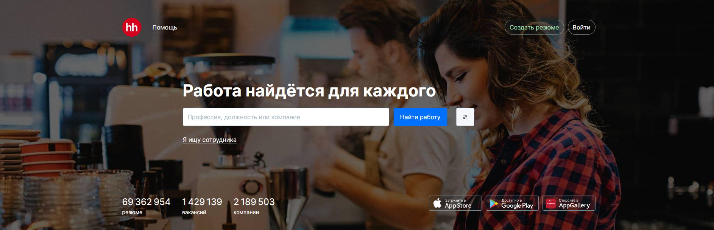
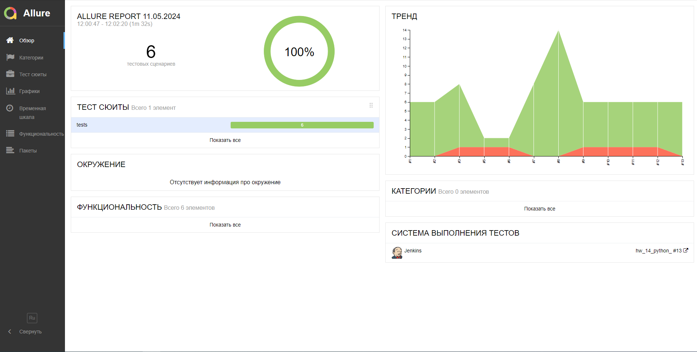
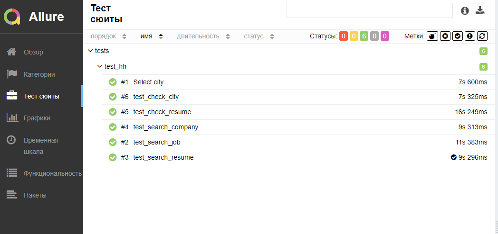
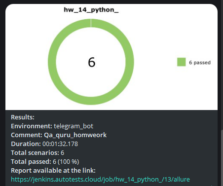
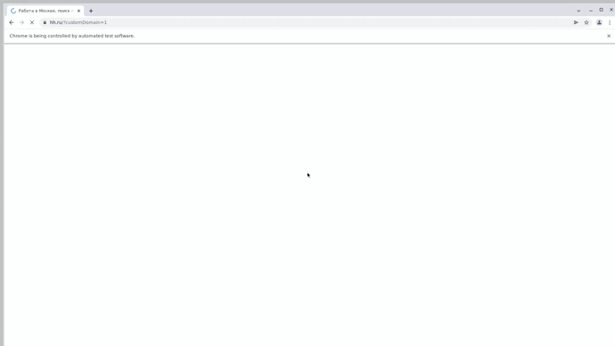

# Автотесты для сайта hh.ru

[hh.ru](https://hh.ru/)

## Особенности проекта

- Запуск web UI автотестов в Selenoid
- Сборка проекта в Jenkins
- Отчеты Allure Report
- Оповещения о тестовых прогонах в Telegram
- Отчеты с видео, скриншотом, логами, исходной моделью разметки страницы

## Список проверок, реализованных в web UI автотестах
- Выбор города
- Поиск работы
- Поиск резюме
- Поиск компании
- Проверка выполненых задач
## Используемый стэк

## Запуск тестов из терминала
### Для запуска всех автотестов выполнить в cli:
> python -m venv .venv  
> source .venv/bin/activate   
> pip install -r requirements.txt   
> pytest .

### Получение отчета allure:
> allure serve allure-results
> 
> 
## Проект в Jenkins
[Jekins](https://jenkins.autotests.cloud/job/hw_14_python_/)

### Запуск автотестов в Jenkins:
1. Открыть проект в [Jekins](https://jenkins.autotests.cloud/job/hw_14_python_/)

2. Нажать кпопку 

## [Allure отчет](https://jenkins.autotests.cloud/job/hw_14_python_/13/allure/)

### [Результат прохождения теста](https://jenkins.autotests.cloud/job/hw_14_python_/13/allure/#suites)

## [Оповещения в Telegram](https://ru.wikipedia.org/wiki/Telegram)

## [Видео прохождения автотестов](https://selenoid.autotests.cloud/video/93ce3d0fe17922d2d1efc4071cda460d.mp4)

 